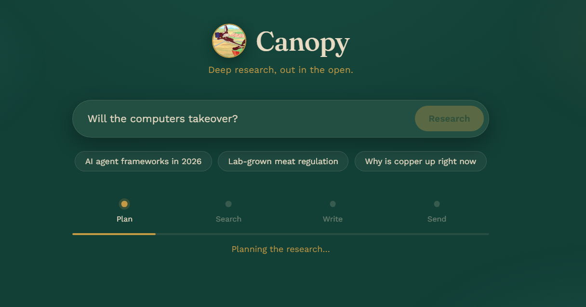
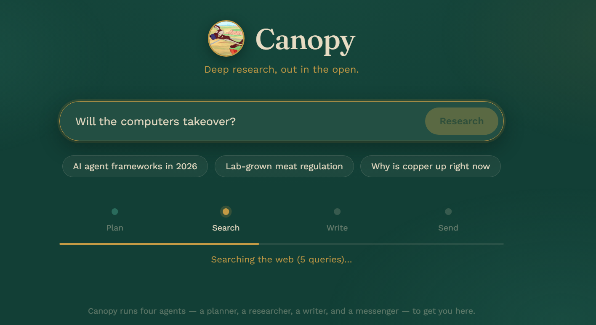
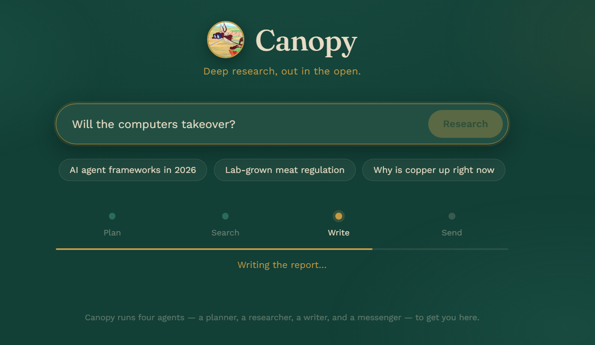
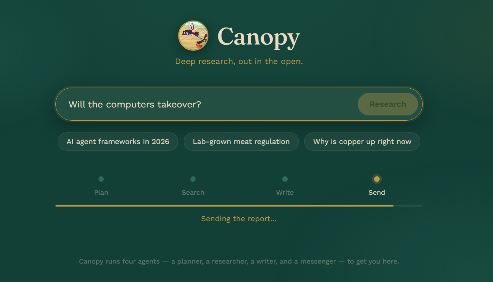
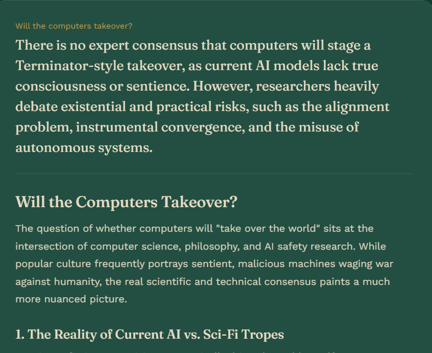

# Canopy  Deep Research Agent

A 4-agent research pipeline (**Plan → Search → Write → Send**) built on the
OpenAI Agents SDK, with a small styled web UI on top so you can actually use
it instead of running it cell-by-cell in a notebook.

Give it a question, and it plans a set of searches, runs them, writes a
structured markdown report, saves it locally, and (optionally) emails it to
you  all with live progress in the browser.



## Why this exists

I built this as a refactored version of a 'Deep Research' lab notebook
refactored out of one big `.ipynb` into an importable package
(`deep_research/`), with retries, structured logging, graceful degradation
when optional integrations aren't configured, and a proper frontend instead
of `print()` statements.

**One thing worth calling out: free web search.** The OpenAI Agents SDK
ships a built-in `WebSearchTool`, but it's a paid, metered tool. This
project uses its own `web_search` tool instead — built on
[DDGS](https://pypi.org/project/ddgs/) (DuckDuckGo Search), completely free
and unauthenticated, with retry/backoff built in so one flaky call doesn't
take down a whole research run. If you just want deep research without
racking up search costs, this is the tool to point your own agents at.

## How it works

```
your question
    → Planner Agent      (decides what to search for)
    → Research Agent      (searches the web, free DDGS-based tool)
    → Writer Agent          (turns results into a structured markdown report)
    → saved to /reports
    → Email Agent             (optional — emails you the report)
```

Every step is retried on failure, a failed search never kills the whole run,
and the report is saved to disk *before* the email step — so a broken email
integration never costs you a finished report.

## Screenshots

| Planning | Searching | Writing |
|---|---|---|
|  |  |  |

| Sending the email | Confirmation |
|---|---|
|  |  |

**The finished report:**



## Getting started

```bash
git clone https://github.com/OmarAboalola/deep_research_agent.git
cd deep_research_agent

pip install -r requirements.txt
cp .env.example .env   # add your model provider's API key
```

You'll also need to pick a model provider in `.env` (`MODEL_PROVIDER` —
`google`, `groq`, or `openrouter`) and set the matching API key.

### Run the web UI

```bash
python server.py
```

Then open **http://localhost:8000** — type a question, watch it plan,
search, and write, and read the report right in the browser.

### Run from the CLI

```bash
python main.py "Most popular AI agent frameworks in 2026"
```

### Use it as a library

```python
from deep_research import run_deep_research

report = await run_deep_research(
    "your question",
    on_status=lambda stage, msg: print(stage, msg),  # optional progress callback
)
```

## Email (optional)

Sending the finished report by email is optional. It expects a
`messenger.py` on your Python path exposing:

```python
def send_email(subject: str, text_body: str, html_body: str) -> None: ...
def push(message: str) -> None: ...
```

If you don't have one, set `USE_EMAIL=false` in `.env` — the pipeline logs
the email instead of sending it, and nothing else breaks. The report is
always saved to `reports/` either way.

## Project structure

```
deep_research/
  config.py            # env loading, logging, startup validation
  schemas.py           # WebSearchItem, WebSearchPlan, ReportData
  search_tool.py        # free web_search tool (DDGS + retries) — see above
  email_tool.py          # send_email_tool (guarded messenger import)
  llm_clients.py          # provider-selectable model construction
  agents_setup.py          # builds the 4 Agent objects
  research_manager.py       # orchestration: plan → search → write → save → email
server.py                  # FastAPI server — job/poll API + serves frontend/
frontend/
  index.html                 # the web UI
main.py                        # CLI entry point
requirements.txt
.env.example
```

## Before you deploy this for real

- **Rate limits.** DDGS is free but unauthenticated, and will rate-limit
  under real load. Swap in a paid search API (Bing, SerpAPI, Tavily) behind
  the same `web_search` interface if you outgrow it.
- **Verify your model name.** Model IDs get renamed/deprecated — double
  check whatever you set in `.env` still resolves for your provider.
- **Don't ship `.env`.** Use your platform's secret manager in production.

## License

MIT — do what you want with it.
